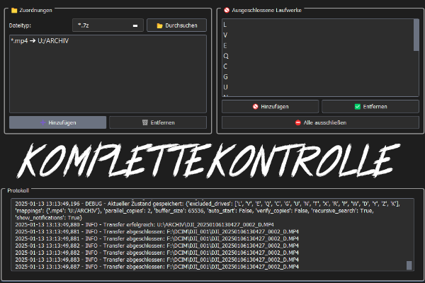
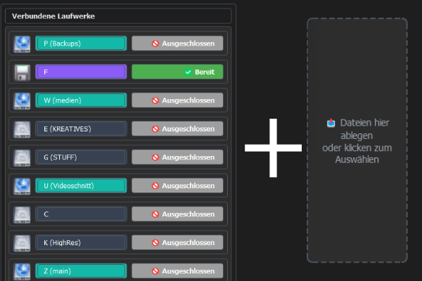
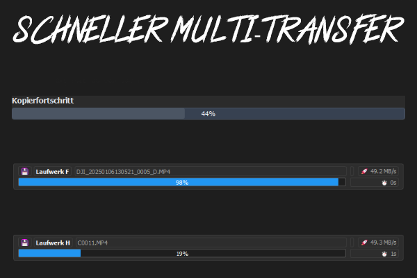

<div align="center">
  
  <h1>🚀 TheGeekFreaks Ingest-Tool</h1>
  <p>Ein modernes und effizientes Dateimanagement-Tool für professionelle Dateiübertragungen zwischen Laufwerken.</p>
  <p>Optimiert für Fotografen, Videografen und Content Creator.</p>

  
  
  
  
  [](https://github.com/The-Geek-Freaks/Ingest-Tool/issues)
  [](https://github.com/The-Geek-Freaks/Ingest-Tool/stargazers)
  [](https://tgf.click/discord)
</div>

## 📑 Inhaltsverzeichnis
- [✨ Hauptfunktionen](#-hauptfunktionen)
- [🎯 Anwendungsfälle](#-anwendungsfälle)
- [💻 Installation](#-installation)
- [🛠️ Konfiguration](#️-konfiguration)
- [🎮 Bedienung](#-bedienung)
- [⚡ Performance](#-performance)
- [🗺️ Roadmap](#️-roadmap)
- [🔧 Fehlerbehebung](#-fehlerbehebung)
- [📄 Lizenz](#-lizenz)

<div align="center">
  
</div>

## ⭐ Highlights

<div align="center">
  <table>
    <tr>
      <td align="center">
        <br/>
        <b>Intelligentes Mapping</b>
      </td>
      <td align="center">
        <br/>
        <b>Echtzeit-Monitoring</b>
      </td>
      <td align="center">
        <br/>
        <b>Schnelle Transfers</b>
      </td>
    </tr>
  </table>
</div>

## ✨ Hauptfunktionen

### 📁 Moderne Benutzeroberfläche
- **Drag & Drop Support**: Einfaches Ziehen und Ablegen von Dateien mit intelligenter Dateityperkennung
- **Dark Mode**: Augenschonende dunkle Benutzeroberfläche
- **Responsive Design**: Dynamische Anpassung an verschiedene Fenstergrößen
- **Intuitive Bedienung**: Klare und übersichtliche Benutzerführung

### 🔄 Intelligentes Dateimanagement
- **Automatische Laufwerkserkennung**: Sofortige Erkennung von USB-Sticks, SD-Karten und Netzwerklaufwerken
- **Smart-Sorting**: Automatische Sortierung und Zuordnung nach Dateitypen
- **Echtzeit-Überwachung**: Sofortige Verarbeitung neuer Dateien
- **Duplikaterkennung**: Intelligenter Umgang mit existierenden Dateien
  - Überspringen identischer Dateien
  - Automatische Umbenennung bei unterschiedlichen Dateigrößen

### 🔄 Leistungsstarke Übertragung
- **Sichere Transfers**: Temporäre Dateien während der Übertragung
- **Parallele Transfers**: Mehrere Dateien gleichzeitig übertragen
- **Fortschrittsanzeige**: Detaillierte Statusanzeige für jeden Transfer
- **Laufwerks-Management**: Flexible Verwaltung von Quell- und Ziellaufwerken
- **Fehlerbehandlung**: Robuste Fehlerbehandlung und Wiederaufnahme
- **Logging**: Umfangreiche Protokollierung aller Aktivitäten

## ⚡ Performance

| Operation | Geschwindigkeit |
|-----------|----------------|
| Kopieren (SSD → SSD) | ~500 MB/s |
| Kopieren (HDD → SSD) | ~120 MB/s |
| Kopieren (NVMe → NVMe) | ~2000 MB/s |
| Dateianalyse | ~10.000 Dateien/s |

## 🚀 Installation

### Windows Installer
⬇️ [Neueste Version herunterladen](https://github.com/The-Geek-Freaks/Ingest-Tool/releases/latest)

### Manuelle Installation
```bash
# Repository klonen
git clone https://github.com/The-Geek-Freaks/Ingest-Tool.git

# Ins Verzeichnis wechseln
cd Ingest-Tool

# Abhängigkeiten installieren
pip install -r requirements.txt

# Programm starten
python main.py
```

## 📚 Beispiele

### Foto-Import von SD-Karte
```json
{
  "mappings": {
    "*.CR2": "D:/Fotos/RAW",
    "*.CR3": "D:/Fotos/RAW",
    "*.NEF": "D:/Fotos/RAW",
    "*.JPG": "D:/Fotos/JPG",
    "*.MP4": "D:/Videos"
  }
}
```

## 🗺️ Roadmap

- [x] Basis-Funktionalität
- [x] Drag & Drop Support
- [x] Intelligente Dateizuordnung
- [x] Fortschrittsanzeige
- [ ] Profi-Funktionen
- [ ] Crossplattform
- [ ] Rechtsklickintegration
- [ ] API für Entwickler

## 👥 Community

[](https://discord.gg/thegeekfreaks)
[](https://twitter.com/thegeekfreaks)

- 🤝 [Wie du beitragen kannst](CONTRIBUTING.md)
- 💬 [Community-Richtlinien](CODE_OF_CONDUCT.md)
- 🌟 [Hall of Fame](https://github.com/The-Geek-Freaks/Ingest-Tool/graphs/contributors)

## 🔧 Fehlerbehebung

### Bekannte Probleme
- **Laufwerkserkennung**: Stellen Sie sicher, dass die Laufwerke korrekt eingebunden sind
- **Dateizuordnungen**: Überprüfen Sie die korrekte Syntax der Dateityp-Zuordnungen (*.ext oder .ext)
- **Netzwerkpfade**: Bei Netzwerkpfaden auf korrekte Zugriffsrechte achten

### Support
- **GitHub Issues**: [Bug-Reports und Feature-Requests](https://github.com/The-Geek-Freaks/Ingest-Tool/issues)
- **E-Mail**: support@thegeekfreaks.de
- **Discord**: [TheGeekFreaks Community](https://discord.gg/thegeekfreaks)

### Logs
- Programm-Logs: `logs/ingest.log`
- Error-Logs: `logs/error.log`
- Transfer-Logs: `logs/transfer.log`

## 📄 Lizenz

Dieses Projekt ist unter der GNU General Public License v3.0 (GPLv3) lizenziert - siehe [LICENSE](LICENSE) für Details.

Diese Lizenz garantiert Ihnen folgende Freiheiten:
- Die Software für jeden Zweck auszuführen
- Die Software zu studieren und zu modifizieren
- Kopien der Software weiterzugeben
- Modifizierte Versionen der Software zu verbreiten

Unter der Bedingung, dass:
- Der Quellcode aller abgeleiteten Werke unter der GPLv3 veröffentlicht wird
- Alle Änderungen dokumentiert werden
- Die vollständige Lizenz und Copyright-Hinweise beibehalten werden

Für die vollständige Lizenz siehe: [GNU GPLv3](https://www.gnu.org/licenses/gpl-3.0.en.html)

## 📝 Changelog

Eine detaillierte Liste aller Änderungen finden Sie in der [CHANGELOG.md](CHANGELOG.md) Datei.

---
<div align="center">
  <p>Entwickelt mit ❤️ von TheGeekFreaks</p>
  <p>Copyright © 2025 TheGeekFreaks. Alle Rechte vorbehalten.</p>
</div>
